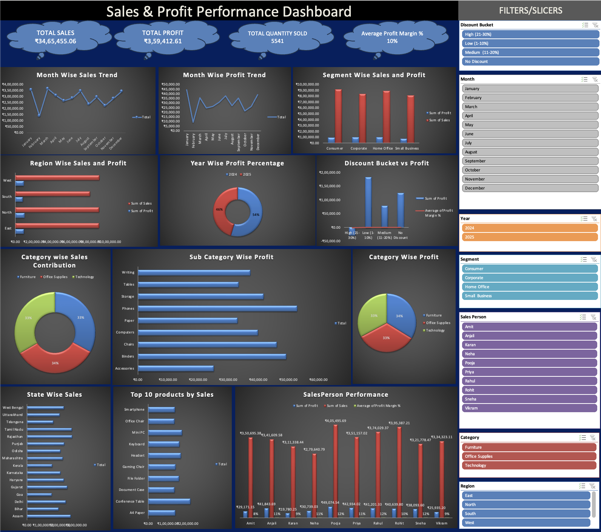

# Sales & Profit Performance Dashboard

An interactive Excel dashboard designed to analyse sales, profitability, discounts, customer segments, products, and regional performance.

## Dashboard Preview

## Key KPIs

- Total Sales: ₹34,65,455.06
- Total Profit: ₹3,59,412.61
- Total Quantity Sold: 5,541
- Average Profit Margin: 10%

## Dashboard Features

- Month-wise Sales and Profit Trend
- Region-wise Sales and Profit Analysis
- State-wise Sales Performance
- Category and Sub-category Profit Analysis
- Top 10 Products by Sales
- Salesperson Performance Analysis
- Segment-wise Sales and Profit
- Discount Bucket vs Profit Analysis
- Interactive slicers for Year, Month, Region, Category, Segment, Salesperson, and Discount Bucket

## Tools Used

- Microsoft Excel
- Pivot Tables
- Pivot Charts
- Slicers
- Data Analysis and Dashboard Design

## Key Insight

The dashboard helps identify high-performing regions, products, categories, salespeople, and the effect of discount levels on profitability.
